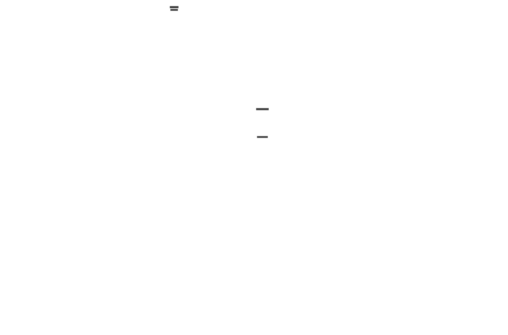

## About project

This FastAPI CRUD web app represents my interpretation of Clean Architecture.

The project's functionality is a primitive blog: users can register, login to account, and view articles. CRUD for Articles, Comments and Users entities.

<p align="center">
  
  <br><em><b>Dependencies structure. You can get more detailed view if you go to docs/dishka_d2.svg and download file (or go to docs/dependencies-structure.d2 and paste it into https://play.d2lang.com/)</b></em>
</p>

ENV Vars:

```commandline
# Database
DB_HOST=
DB_PORT=
DB_NAME=
DB_USER=
DB_PASSWORD=

# SQLAlchemy settings
SQLA_ENG_ECHO=
SQLA_ENG_ECHO_POOL=
SQLA_ENG_POOL_SIZE=
SQLA_ENG_MAX_OVERFLOW=
SQLA_SESS_AUTOFLUSH=
SQLA_SESS_AUTOCOMMIT=
SQLA_SESS_EXPIRE_ON_COMMIT=

# Session secret for starlette.middleware.sessions.SessionMiddleware
SESSION_SECRET=

# Password pepper for hashing
PASSWORD_PEPPER=

# Redis connection envs
REDIS_HOST=
REDIS_PORT=

# Envs for smtp server (used by Celery worker for sending emails)
SMTP_HOST=
SMTP_HOST_USER=
SMTP_HOST_PASSWORD=
SMTP_PORT=

# Envs for creating random integer code when user's processing the registration
CODE_GENERATOR_MIN_VAL=
CODE_GENERATOR_MAX_VAL=

# Uvicorn start settings
UVICORN_HOST=
UVICORN_PORT=
UVICORN_RELOAD=

# JWT envs
JWT_SECRET=
JWT_ALGORITHM=

# Logging level for logging package
LOGGING_LEVEL=
```

## How to run the project

ENV setup help:

How to get SMTP_HOST_PASSWORD:

Go to your Google account's settings -> in the search engine, enter "App password" -> create new app and get sixteen digit password

```python
import secrets

# jwt secret if jwt_algorithm is HS256
jwt_secret = secrets.token_hex(32)
print(f"JWT_SECRET: {jwt_secret}")

# password pepper for hashing
password_pepper = secrets.token_hex(16)
print(f"PASSWORD_PEPPER: {password_pepper}")

session_secret = secrets.token_hex(16)
print(f"SESSION_SECRET: {session_secret}")
```

To install dependencies using Poetry, run:

`./FastAPI-DDD$ poetry install`

Using pip:

`python -m venv env`

Activation:

`venv\Scripts\activate` - Windows

`source venv/bin/activate` - Linux/macOS

Installation:

`pip install -r requirements.txt`

Alembic's migrations:

`./FastAPI-DDD/src/infrastructure/persistence$ poetry run alembic upgrade head`

After settings all envs you need to run redis. I use docker:

`docker run -d --rm --name redis -p 6379:6379 redis`

Then run celery:

`./FastAPI-DDD/src$ poetry run python -m celery-run` - using poetry

`/FastAPI-DDD/src$ python -m celery-run` - without poetry

Backend:

`/FastAPI-DDD/src$ poetry run python -m run` - using poetry

`/FastAPI-DDD/src$ python -m run` - without poetry

/api/docs - swagger's doc
